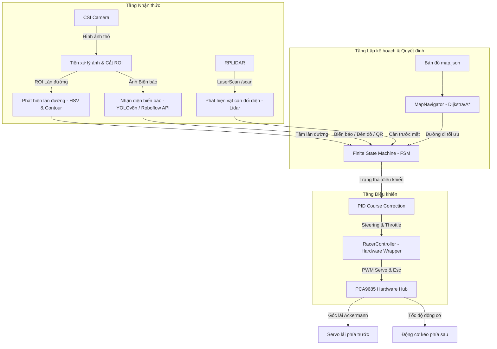
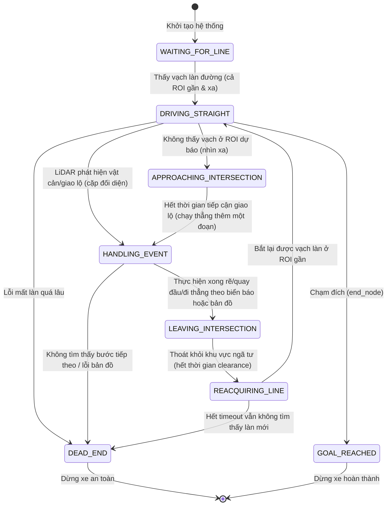

# Tổng quan Kiến trúc Hệ thống JetsonAIRacer 2026

Tài liệu này cung cấp cái nhìn toàn cảnh về cấu trúc thư mục, mô hình mô-đun hóa của phần mềm tự hành, kiến trúc ROS và sơ đồ máy trạng thái (FSM) tổng quát điều khiển xe.

---

## 1. Cấu trúc Thư mục Dự án

Hệ thống được tổ chức thành các thư mục rõ ràng theo nguyên tắc phân tách nhiệm vụ (Separation of Concerns). Dưới đây là sơ đồ cây thư mục chi tiết của dự án:

```text
JetsonAIRacer/
├── README.md                 # Tài liệu hướng dẫn chung của toàn dự án
├── docs/                     # Thư mục chứa tài liệu đặc tả hệ thống
│   ├── DocumentJetracer.md   # Hướng dẫn phần mềm/phần cứng JetRacer gốc
│   ├── proposal.md           # Đề cương nghiên cứu giải pháp (Tiếng Việt)
│   └── proposal_en.md        # Đề cương nghiên cứu giải pháp (Tiếng Anh)
├── JetRacer/                 # Thư viện torchvision cài đặt trên thiết bị nhúng
├── speed_track/              # Script khởi chạy nhanh của Speed Track (root)
│   └── main_speed_track.py
└── src/                      # Mã nguồn chính phát triển các module điều khiển
    ├── __init__.py
    ├── test.py               # File script test nhanh
    ├── core/                 # Thư viện core dùng chung cho cả hai chế độ chạy
    │   ├── __init__.py
    │   ├── control/          # Module điều khiển động cơ và góc lái
    │   │   ├── __init__.py
    │   │   └── racer_controller.py
    │   ├── perception/       # Module nhận thức (xử lý camera, LiDAR)
    │   │   └── __init__.py
    │   ├── planning/         # Module lập lộ trình và tìm đường đi
    │   │   ├── __init__.py
    │   │   ├── callmap.py    # Đồng bộ bản đồ từ máy chủ cuộc thi
    │   │   └── map_navigator.py
    │   └── utils/            # Thư mục tài nguyên và tiện ích bổ trợ
    │       ├── __init__.py
    │       ├── map.json      # Dữ liệu bản đồ ngã rẽ và các nút tọa độ
    │       └── opposite_detector.py # Module phát hiện cổng/vật cản đối diện bằng LiDAR
    ├── smart_city/           # Chương trình chạy chính chế độ Đô thị thông minh
    │   └── main_smart_city.py
    └── speed_track/          # Chương trình chạy chính chế độ Tốc độ
        └── main_speed_track.py
```

---

## 2. Mô hình Kiến trúc Mô-đun Hóa

Phần mềm tự hành JetsonAIRacer được thiết kế dựa trên kiến trúc 3 tầng kinh điển của Robot tự hành: **Perception (Nhận thức) -> Planning (Quyết định/Lập kế hoạch) -> Control (Điều khiển)**.



### Chi tiết các tầng:
1. **Tầng Nhận thức (Perception Layer):**
   - Đảm nhiệm việc thu thập dữ liệu từ phần cứng (Camera CSI, Cảm biến Khoảng cách RPLIDAR).
   - Xử lý các tác vụ xử lý ảnh thô, phân vùng vùng quan tâm (ROI), tách lọc màu sắc làn đường.
   - Nhận diện biển báo giao thông và các vật thể thông qua mô hình học sâu.
   - Trích xuất khoảng cách và góc của các chướng ngại vật xung quanh xe.

2. **Tầng Quyết định (Planning Layer):**
   - Đóng vai trò là bộ não của xe. Sử dụng Máy trạng thái hữu hạn (FSM) để theo dõi và chuyển đổi giữa các trạng thái hoạt động dựa trên các sự kiện đầu vào của tầng nhận thức.
   - Thực hiện tìm kiếm đường đi ngắn nhất từ xuất phát đến đích trên đồ thị bản đồ.
   - Áp dụng các bộ lọc chống nhiễu (như Hysteresis) để khử nhiễu phát hiện tức thời của camera trước khi đưa ra quyết định hành động tại các nút giao lộ.

3. **Tầng Điều khiển (Control Layer):**
   - Tiếp nhận lệnh hành động từ tầng quyết định (ví dụ: bám làn đường thẳng, rẽ trái tại ngã tư, dừng xe, lùi xe).
   - Sử dụng bộ điều khiển PID hoặc bộ điều khiển tốc độ tự thích ứng để tính toán ra hai giá trị điều khiển vật lý: **Steering (góc lái)** và **Throttle (tốc độ ga)**.
   - Truyền tín hiệu điều khiển xuống tầng phần cứng qua PCA9685.

---

## 3. Kiến trúc Truyền thông ROS (Robot Operating System)

Dự án vận hành trên nền tảng hệ điều hành **ROS Melodic** (cài đặt trên Ubuntu 18.04 - Jetpack 4.5.1). Các thành phần trao đổi dữ liệu thông qua cơ chế Publish/Subscribe của ROS:

- **/csi_cam_0/image_raw (sensor_msgs/Image):** Topic publish hình ảnh thời gian thực thu được từ camera CSI phía trước của xe.
- **/scan (sensor_msgs/LaserScan):** Topic publish dữ liệu quét khoảng cách xung quanh từ cảm biến RPLIDAR.
- **ROS Bridge / Nodes:** Do ROS Melodic chạy trên Python 2, trong khi các thuật toán nhận diện và AI chạy trên môi trường Python 3, hệ thống sử dụng các bridge để chuyển tiếp dữ liệu hình ảnh và Lidar giữa hai môi trường một cách mượt mà thông qua ROS topic hoặc các kết nối MQTT.

---

## 4. Mô hình Trạng thái FSM Tổng quát

Vòng đời chạy của xe tự hành được kiểm soát chặt chẽ bởi máy trạng thái hữu hạn `RobotState` với 8 trạng thái đặc trưng:



Chi tiết hoạt động và điều kiện chuyển trạng thái sẽ được trình bày cụ thể trong tài liệu [pipeline_execution.md](file:///d:/JetsonAIRacer/docs/pipeline_execution.md).
