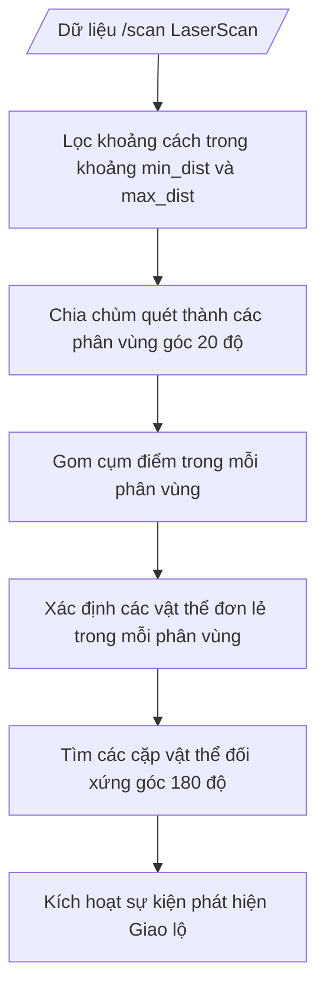

# Tài liệu Chi tiết Module Nhận thức (Perception Module)

Module Nhận thức đảm nhiệm vai trò tiếp nhận dữ liệu cảm biến (Hình ảnh từ CSI Camera, Khoảng cách từ RPLIDAR) để dựng lại mô hình trạng thái môi trường xung quanh xe. Dưới đây là mô tả chi tiết các thuật toán xử lý làn đường, biển báo giao thông và vật cản bằng cảm biến.

---

## 1. Thuật toán Xử lý Làn đường bằng Camera (Lane Processing)

Quá trình bám làn sử dụng thị giác máy tính truyền thống (OpenCV) với cơ chế lọc thông tin nâng cao nhằm tối đa hóa độ chính xác và giảm thiểu tài nguyên xử lý của CPU/GPU.

### 1.1. Cơ chế vùng quan tâm kép (Dual ROI - Region of Interest)
Để kiểm soát xe mượt mà và dự đoán trước cua, hệ thống chia khung hình thành hai vùng ROI độc lập:
- **ROI Chính (Execution ROI - Vùng Thực thi):** Nằm ở phía dưới cùng khung hình (từ $85\%$ đến $100\%$ chiều cao ảnh). Vùng này dùng để tính toán sai lệch tức thời phục vụ điều khiển bám line.
- **ROI Dự báo (Lookahead ROI - Vùng Nhìn xa):** Nằm ở phía trên (từ $60\%$ đến $75\%$ chiều cao ảnh). Vùng này đóng vai trò cảnh báo sớm. Khi line biến mất ở ROI dự báo, xe nhận biết sắp có giao lộ hoặc ngã rẽ lớn để chuẩn bị chuyển trạng thái.

### 1.2. Thuật toán mặt nạ màu sắc và mặt nạ tập trung (Focus Mask)
Để xe không bị nhận diện nhầm các làn đường phụ, vạch biên sa bàn, hoặc nhiễu bên ngoài, thuật toán triển khai cơ chế lọc kép:
1. **Lọc không gian HSV:** Chuyển đổi ROI sang không gian màu HSV và lọc theo dải ngưỡng `LINE_COLOR_LOWER` `[0, 0, 0]` đến `LINE_COLOR_UPPER` `[180, 255, 75]`. Bước này tạo ra một mặt nạ nhị phân (`color_mask`) chứa các điểm ảnh tối/vạch đen.
2. **Focus Mask (Mặt nạ tập trung):** Tạo ra một mặt nạ nhị phân chỉ lấy vùng hình chữ nhật nằm chính giữa ROI (chiều rộng bằng $50\%$ chiều rộng ảnh).
3. **Phép AND nhị phân:** Kết hợp hai mặt nạ bằng hàm `cv2.bitwise_and`. Chỉ các điểm ảnh màu đen nằm ở vùng trung tâm mới được giữ lại. Điều này giúp loại bỏ hoàn toàn nhiễu từ các làn đường bên cạnh hoặc các đối tượng xung quanh sa bàn.

```text
Khung hình gốc (300x300)
    ┌───────────────────────────┐
    │                           │
    │ ─── Lookahead ROI ─────── │ -> Nhìn xa (Cảnh báo mất line)
    │                           │
    │ ─── Execution ROI ─────── │ -> Bám làn (Lọc HSV + Focus Mask 50% ở giữa)
    └───────────────────────────┘
```

### 1.3. Tính toán trọng tâm vạch làn (Contours & Image Moments)
Hàm [_get_line_center()](file:///d:/JetsonAIRacer/src/speed_track/main_speed_track.py#L532) thực hiện các bước sau:
1. Tìm các đường bao contour từ mặt nạ kết hợp thông qua `cv2.findContours`.
2. Lọc contour có diện tích lớn nhất và kiểm tra nếu diện tích của nó lớn hơn ngưỡng tối thiểu `SCAN_PIXEL_THRESHOLD` (mặc định 100 pixels) nhằm tránh nhiễu đốm nhỏ.
3. Tính toán moment không gian của contour:
   $$M = \text{cv2.moments}(c)$$
4. Xác định tọa độ ngang của trọng tâm (Centroid $X_c$):
   $$X_c = \frac{M_{10}}{M_{00}}$$
5. Trả về giá trị $X_c$ là tâm của vạch làn đường.

---

## 2. Nhận dạng Biển báo & Sự kiện Đô thị (Sign & Event Detection)

Hệ thống hỗ trợ 2 hướng tiếp cận nhận diện vật thể tùy thuộc vào cấu hình của bài thi:

### 2.1. Nhận dạng cục bộ với YOLOv8-nano ONNX (Speed Track)
Chạy trực tiếp mô hình ONNX đã huấn luyện thông qua thư viện `onnxruntime` trên GPU Jetson Nano.
- **Tiền xử lý:** Resize ảnh về kích thước $640 \times 640$, chuẩn hóa giá trị pixel về dải $[0.0, 1.0]$, chuyển đổi từ HWC sang CHW và thêm chiều batch.
- **Hậu xử lý NMS (Non-Maximum Suppression):** Do thư viện ONNX thô trả về rất nhiều bounding box chồng chéo, hàm [numpy_nms()](file:///d:/JetsonAIRacer/src/speed_track/main_speed_track.py#L175) thực hiện thuật toán NMS trên NumPy để lọc các box có độ tin cậy thấp hơn `YOLO_CONF_THRESHOLD` ($0.6$) và các box trùng lặp có độ phủ chéo nhau (IoU) lớn hơn ngưỡng `nms_threshold` ($0.45$).
- **Lớp phân loại:** Nhận diện 9 lớp bao gồm hướng biển lệnh (`N`, `E`, `W`, `S`), biển cấm hướng tương ứng (`NN`, `NE`, `NW`, `NS`) và biển bài toán toán học (`math`).

### 2.2. Nhận dạng qua đám mây với Roboflow Inference API (Smart City)
Trong chế độ Smart City, để cải thiện độ chính xác và linh hoạt, hệ thống sử dụng kết nối mạng để gửi ảnh tới API Roboflow thông qua hàm [detect_with_yolo()](file:///d:/JetsonAIRacer/src/smart_city/main_smart_city.py#L254):
1. Mã hóa khung hình sang định dạng JPEG bằng `cv2.imencode`.
2. Thực hiện HTTP POST gửi ảnh trực tiếp tới endpoint:
   `https://detect.roboflow.com/{RF_MODEL}/{RF_VERSION}?api_key={RF_API_KEY}`
3. Phân tích kết quả trả về dưới dạng JSON, ánh xạ tọa độ bounding box tương đối hoặc tuyệt đối về kích thước ảnh gốc.

---

## 3. Phát hiện Vật cản đối diện bằng cảm biến LiDAR (LaserScan)

Cảm biến LiDAR được sử dụng chủ yếu để phát hiện cổng chào giao lộ hoặc các chướng ngại vật phía trước mà camera khó ước lượng khoảng cách chính xác. Lớp [SimpleOppositeDetector](file:///d:/JetsonAIRacer/src/core/utils/opposite_detector.py#L13) thực hiện phân tích dữ liệu khoảng cách `/scan`:



### Các bước thuật toán chi tiết:
1. **Phân vùng quét (Zone Slicing):** Chia toàn bộ chùm quét Lidar góc $360^\circ$ thành các phân vùng nhỏ, mỗi phân vùng có dải góc `angle_range` ($20.0$ độ).
2. **Gom cụm vật thể (Object Clustering):** Trong mỗi phân vùng, thuật toán [detect_object_in_zone()](file:///d:/JetsonAIRacer/src/core/utils/opposite_detector.py#L151) lọc ra các điểm có khoảng cách nằm trong dải an toàn (từ `min_distance` $0.25\text{ m}$ đến `max_distance` $0.35\text{ m}$). Nó nhóm các điểm kề nhau (khoảng cách chỉ số góc sai khác $\le 2$ và chênh lệch cự ly quét $\le 0.10\text{ m}$) thành một cụm. Cụm nào có số điểm lớn hơn `object_min_points` ($15$ điểm) được công nhận là một vật thể.
3. **Xác định cặp đối xứng (Opposite Detection):** Thuật toán [find_opposite_pairs()](file:///d:/JetsonAIRacer/src/core/utils/opposite_detector.py#L117) duyệt qua tất cả vật thể được phát hiện. Nếu tìm thấy hai vật thể có góc lệch tâm xấp xỉ $180^\circ$ (cho phép dung sai `opposite_tolerance` là $5.0$ độ) và khoảng cách góc thực tế lớn hơn `min_opposite_distance` ($45.0$ độ), cặp vật thể này được xác định là hai cột cổng giao lộ/vách ngã rẽ.
4. **Kích hoạt sự kiện:** Khi phát hiện cặp đối xứng này, hàm [process_detection()](file:///d:/JetsonAIRacer/src/core/utils/opposite_detector.py#L126) trả về `True`, báo hiệu xe đã đi đến vị trí cổng giao lộ để dừng lại xử lý hành động rẽ tiếp theo.
