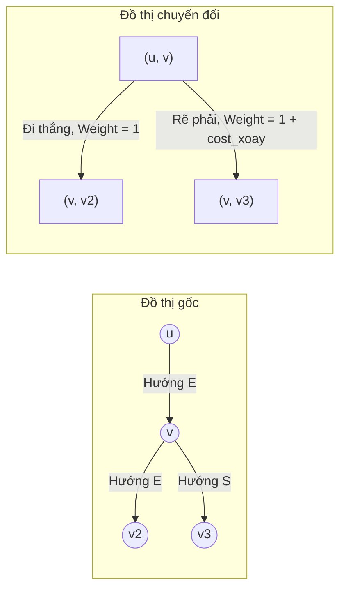
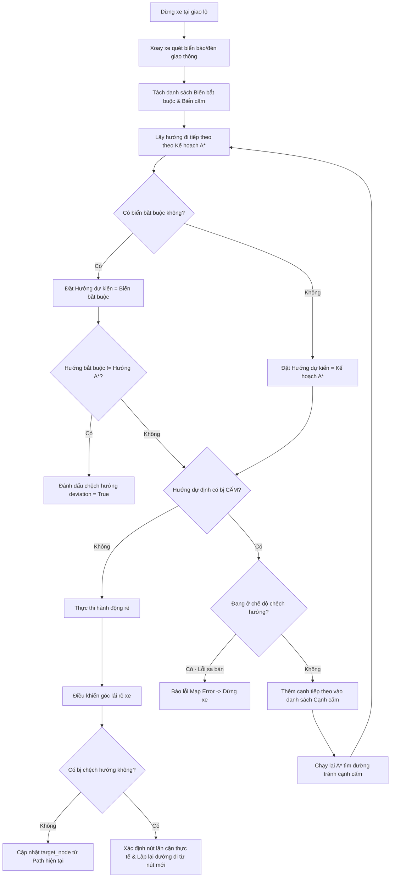

# Tài liệu Module Lập lộ trình & Điều hướng (Planning & Navigation)

Tài liệu này phân tích chi tiết cấu trúc bản đồ số, thuật toán Dijkstra tính chi phí rẽ, thuật toán tìm đường A* và bộ logic xử lý rẽ tại giao lộ khi tích hợp biển báo giao thông.

---

## 1. Cấu trúc Bản đồ số (map.json)

Bản đồ sa bàn được biểu diễn dưới dạng đồ thị có hướng (Directed Graph) lưu trữ trong tệp [map.json](file:///d:/JetsonAIRacer/src/core/utils/map.json). Cấu trúc gồm hai thành phần chính:
- **`nodes` (Các nút giao lộ):** Mỗi nút có một mã định danh duy nhất `id`, thuộc tính `type` (ví dụ: `'start'`, `'end'`, hoặc rỗng), và tọa độ vị trí thực tế `x`, `y` trên sa bàn.
- **`edges` (Các đoạn đường nối giữa hai nút):** Mỗi cạnh xác định hướng đi một chiều từ nút `source` tới nút `target`, kèm theo nhãn `label` thể hiện hướng tuyệt đối địa lý của đoạn đường đó (nhận một trong các giá trị: `'N'` - Bắc, `'E'` - Đông, `'S'` - Nam, `'W'` - Tây).

```json
{
  "nodes": [
    {"id": 1, "x": 100, "y": 200, "type": "start"},
    {"id": 2, "x": 200, "y": 200, "type": ""}
  ],
  "edges": [
    {"source": 1, "target": 2, "label": "E"}
  ]
}
```

---

## 2. Thuật toán Dijkstra Tích hợp Chi phí Rẽ (ShortestPathFinder)

Thông thường, thuật toán tìm đường đi ngắn nhất chỉ tính số lượng nút hoặc chiều dài quãng đường. Tuy nhiên, đối với xe tự hành, **hành động rẽ luôn có rủi ro cao hơn và làm giảm tốc độ của xe so với đi thẳng**. Do đó, lớp [ShortestPathFinder](file:///d:/JetsonAIRacer/src/core/planning/map_navigator.py#L5) triển khai một cơ chế đặc biệt để tính thêm "chi phí xoay/rẽ" (`cost_xoay = 1`):

### 2.1. Biến đổi đồ thị Cạnh thành Đỉnh (Edges to Nodes Conversion)
Để phạt điểm các hành động rẽ, ta không thể tính toán trên đồ thị đỉnh thông thường mà phải chuyển đổi đồ thị gốc:
- Mỗi **cạnh** $(u, v)$ của đồ thị gốc sẽ trở thành một **đỉnh** của đồ thị mới.
- Một cạnh nối giữa đỉnh $(u, v)$ và đỉnh $(v, v_2)$ trên đồ thị mới sẽ được tạo ra nếu có đường đi từ $u \to v \to v_2$.
- **Tính toán trọng số cạnh mới:**
  - Nếu hướng đi của cạnh cũ $(u, v)$ khác hướng đi của cạnh tiếp theo $(v, v_2)$ (tức là xe phải bẻ lái rẽ hướng), trọng số của đường nối này sẽ bằng:
    $$\text{Trọng số} = \text{Trọng số mặc định của cạnh} + \text{cost\_xoay}$$
  - Nếu hai hướng trùng nhau (xe đi thẳng), trọng số chỉ bằng trọng số mặc định của cạnh tiếp theo.



### 2.2. Tìm kiếm Dijkstra
Sau khi xây dựng xong đồ thị chuyển đổi, thuật toán sử dụng hàm `nx.dijkstra_path` của thư viện NetworkX để tìm ra đường đi ngắn nhất tối ưu nhất, giúp xe chủ động chọn những cung đường thẳng dài thay vì chọn đường rẽ ngoằn ngoèo dù tổng số node là như nhau.

---

## 3. Lớp Tương thích Tìm đường A* (MapNavigator)

Lớp [MapNavigator](file:///d:/JetsonAIRacer/src/core/planning/map_navigator.py#L92) cung cấp một wrapper để tương thích với các thuật toán cũ hơn, đồng thời hỗ trợ tìm đường thời gian thực và tránh các đoạn đường bị cấm (banned edges):

- **Ước lượng Heuristic Euclid:** Sử dụng tọa độ địa lý $(x, y)$ của các node trong bản đồ để tính khoảng cách đường chim bay làm hàm heuristic cho thuật toán A*:
  $$h(a, b) = \sqrt{(x_a - x_b)^2 + (y_a - y_b)^2}$$
- **Hỗ trợ loại bỏ cạnh cấm (Dynamic Obstacle/Prohibited Path Avoidance):** Hàm `find_path(start, end, banned_edges)` nhận vào danh sách các cạnh bị cấm di chuyển. Nó sẽ tạm thời xóa bỏ các cạnh này khỏi đồ thị NetworkX trước khi chạy thuật toán tìm đường `astar_path`. Điều này cho phép xe tự động lập lại lộ trình mới nếu làn đường phía trước bị chặn hoặc bị cấm bởi biển báo.

---

## 4. Bộ Logic Quyết định & Điều hướng tại Giao lộ

Khi xe di chuyển đến ngã tư (trạng thái `HANDLING_EVENT`), hàm [handle_intersection()](file:///d:/JetsonAIRacer/src/smart_city/main_smart_city.py#L626) sẽ được gọi để quyết định hướng đi tiếp theo. Quy trình xử lý gồm các bước sau:



### 4.1. Quy tắc chuyển đổi hướng
Hệ thống chuyển đổi hướng đi địa lý tuyệt đối (`'N'`, `'E'`, `'S'`, `'W'`) thành hành động bẻ lái tương đối của xe (`'straight'`, `'left'`, `'right'`, `'turn_around'`) qua hàm [map_absolute_to_relative()](file:///d:/JetsonAIRacer/src/speed_track/main_speed_track.py#L491) dựa trên hướng đầu xe hiện tại của robot:
- Độ lệch góc xoay $D = (TargetIndex - CurrentIndex + 4) \pmod 4$
- $D = 0 \to$ Đi thẳng (`'straight'`)
- $D = 1 \to$ Rẽ phải (`'right'`)
- $D = 3 \to$ Rẽ trái (`'left'`)
- $D = 2 \to$ Quay đầu (`'turn_around'`)

### 4.2. Xử lý Luật Ưu tiên Biển báo
1. **Ưu tiên 1 (Biển chỉ dẫn bắt buộc):** Nếu camera nhận diện được các biển hiệu lệnh (`'L'` - rẽ trái, `'R'` - rẽ phải, `'F'` - đi thẳng), xe sẽ bỏ qua kế hoạch đường đi tối ưu ban đầu của A* để đi theo hướng biển chỉ dẫn này. 
   - Nếu hướng biển chỉ dẫn khác với hướng kế hoạch A*, cờ `is_deviation` (chệch hướng) sẽ được bật lên.
2. **Ưu tiên 2 (Kế hoạch tối ưu):** Nếu không có biển chỉ dẫn bắt buộc, xe sẽ đi theo hướng đề xuất từ kế hoạch tìm đường A* (`planned_path`).
3. **Phủ quyết bởi Biển cấm:** Xe kiểm tra xem hướng đi dự định (từ bước 1 hoặc 2) có trùng với biển báo cấm nhận diện được hay không (ví dụ: dự định rẽ phải nhưng gặp biển cấm rẽ phải `'NR'`).
   - **Trường hợp mâu thuẫn:** Nếu hướng đi dự định bắt buộc từ biển hiệu lệnh lại trùng với biển cấm $\to$ Xung đột sa bàn bất khả thi $\to$ Xe chuyển sang trạng thái dừng khẩn cấp `DEAD_END`.
   - **Trường hợp tránh cạnh cấm:** Nếu hướng đi tối ưu từ kế hoạch A* bị cấm $\to$ Xe thêm cạnh nối giữa nút hiện tại và nút tiếp theo vào mảng `banned_edges`, sau đó gọi tìm đường lại từ nút hiện tại tới đích. Lộ trình mới sẽ tự động tránh hướng đường bị cấm này.

### 4.3. Đồng bộ hóa khi đi chệch hướng (Deviation Re-alignment)
Nếu xe phải rẽ theo biển hiệu lệnh bắt buộc dẫn đến đi lệch khỏi tuyến đường tối ưu cũ (`is_deviation = True`), hệ thống sẽ:
1. Xác định nút kế cận thực tế dựa trên hướng xe mới rẽ bằng hàm `get_neighbor_by_direction`.
2. Hủy bỏ lộ trình cũ và thực hiện lập lại kế hoạch đường đi mới hoàn toàn tính từ nút mới này tới điểm đích.
3. Cập nhật `target_node_id` và chuyển sang trạng thái rời giao lộ bình thường để xe tiếp tục hành trình mà không bị mất phương hướng.
